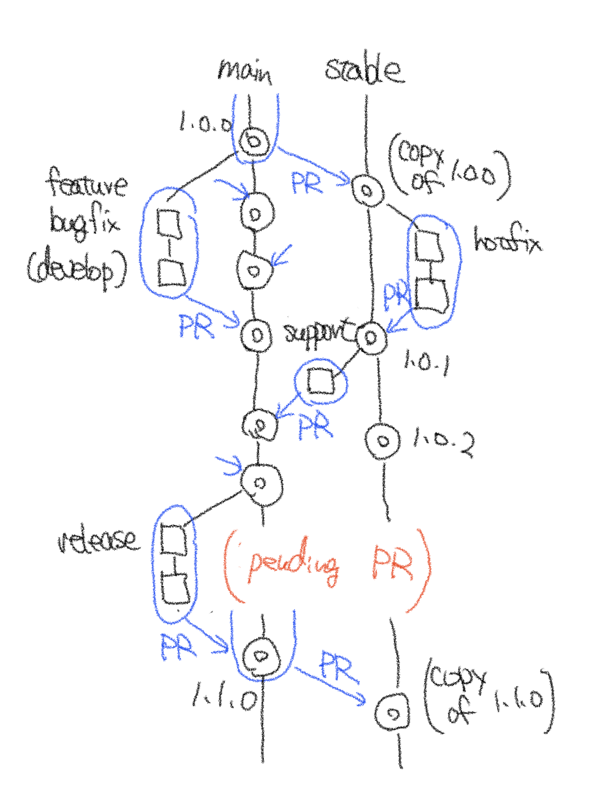

# git-flow Hub
git-flow command substitution for GitHub flow.

## Concept
The concept of this repository is as below.

I add the `stable` branch for a hotfix, and the flow chart becomes very similar to git-flow.

The difference between git-flow and git-flow Hub is as follows.
1. substitute `main` and `develop` branches in git-flow with `stable` and `main` branches.
2. `main` branch (`develop` in git-flow) is always deployable with CI/CD tools.
3. Use pull requests (PRs) to merge.

The most significant difference is the 3rd point.
The git-flow automates the `merge` locally and has no option to change this behavior.
So, a careful selection of commands is needed to avoid unexpected merging.
We will provide command sets to automate this flow easily.
The core feature is implemented by utilizing a wrapper of `git` and `gh` (CLI made by GitHub).

We also provide options to disable `stable` blanch to implement workflow similar to the original GitHub flow.

